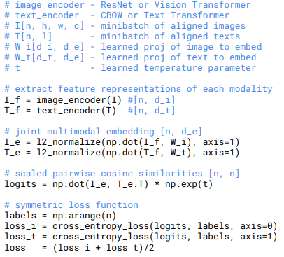

### Transformer
原论文-------------**《Attention Is All You Need》**

概述：解决了nlp领域无法长时序关联的问题，基于纯注意力机制的架构能并行计算，将特征相关联，是后续如GPT、Bert等大模型的基础，同时后续在cv领域也掀起热潮，如后续的VIT，是近几年最有价值的文章之一。
* 位置编码 我们知道，一段话的句意和每个词的位置是有关的，序列的位置信息是有含义的，transformer在词嵌入层后对tokens进行位置嵌入来赋予位置信息

* 非对称的Encoder-Decoder encoder和decoder是非对称结构，transformer的提出最开始是为了处理机器翻译问题，所以对于编码器来说，他能看到全局信息，也就是整个序列，而对于解码器，实际上在预测的时候只能看到当前词之前的部分，所以会对序列进行mask来模拟预测情况
  
* 自注意力机制 自注意力机制可以理解成权重，权重即为注意力机制，在transformer中，对于一个输入词向量X(实际输入为矩阵，这里简化)和三个可学习权重矩阵Wq，Wk，Wv计算后得到所需的Q，K，V向量，Q和K^T的相乘后得到score得分矩阵，归一化后进行softmax得到概率分布矩阵A，简而言之，最后的输入即为Z=A*V
  
* 多头注意力机制 多头注意力机制和上述类似，只不过对输入矩阵X会按注意力头的个数进行拆分，同时可学习权重矩阵Wq，Wk，Wz不止一组，而是和注意力头的个数一直，最后所有注意力头的输出拼接后的结果就是最终输出

对Transformer介绍比较好的[blog](https://blog.csdn.net/Tink1995/article/details/105080033)
自注意力机制和多头注意力机制的原理也可以看这篇博客[CLIP](https://blog.csdn.net/weixin_44791964/article/details/129941386)

### BERT
原论文---------**《BERT》**

概述：在CV领域，对模型进行PreTrain然后再迁移到一个下游子任务上是一个很常见的方式，而在NLP领域这种做法很少，当然一个原因是NLP没有像ImageNet等很大的有标号的数据集，所以在NLP领域基本是对不同任务设计不同的框架，BERT的出现使得终于可以在一个很大的数据集上做训练，再应用到很多的NLP任务上。

* 两个目标 第一是“完型填空”：即随机mask掉某个token，结合上下文对这个mask进行预测。第二是“isNext？”：即给定两个序列，判断这两个序列是否是相邻的两个句子

* 三个嵌入 词嵌入(Token Embeddings) + 片段嵌入(Segment Embeddings) + 位置嵌入(Position Embeddings)，其中片段嵌入可以理解为对Tokens向量中的每个token，判断是否来自于同一个句子，来自句子A的token都会映射为E_A

* 基于上下文，只使用Transformer的Encoder 回顾一下Transformer，对于encoder来说，整个输入序列都是可见的，而对于decoder来说输入是部分可见，所以这是一个单向的过程。Bert基于上下文做“完型填空”，所以不仅要看到这个空之前，也要看到这个空之后，所以只使用了Encoder部分
  
* 训练阶段两个任务并行，所以引入了两个标记[CLS]&[SEP] ，其中[CLS]只在tokens的头部，用于分类任务，[SEP]则添加在句子尾部，用于标记句子结束
  
* 处理未出现的词使用了分词器，这里举个简单的例子，Pretrain会拆分成##Pre+##train两个子词

### Vision Transformer(VIT)
原论文------------**《VIT》**

概述：Transformer出圈到视觉领域。Transformer的输入为序列，如果将图片展平当成序列的话开销巨大，本论文将图片拆解成图像块(patch)，这些图像块就类似于文本中的token，组成一段序列，这就满足了Transformer架构的输入。

* 借鉴了BERT当中的[CLS]，这里是Concat一个cls_token来处理分类任务

[博客地址](https://blog.csdn.net/weixin_42392454/article/details/122667271)

### Masked Autoencoders Are Scalable Vision Learners(MAE)
原论文-----------***《Masked Autoencoders Are Scalable Vision Learners》**

概述：借鉴BERT，将掩码引入VIT，BERT的CV版本。
* BERT使用Transformer编码器拓展到更一般的nlp任务上，使用**完型填空**这样的自监督训练机制，也就是不使用标号，而是通过预测一个句子中空缺的单词(Mask)从而获取对文本特征的抽取能力。

对图像进行patch编码的过程和VIT一样，但是，借鉴BERT，也就是随机盖住一些图像的块(patch)，然后去重构这些被盖住的像素，预测的是patch里所有的像素。同时使用非对称编码器，也就是encoder只能看见没被盖住的patch，decoder能看见所有patch。

* 和BERT类似的自监督训练方式
  
* 非对称的encoder-decoder架构

[详细介绍](https://blog.csdn.net/qq_36758270/article/details/130977990)

### Swin Transformer
原论文----------**《Swin Transformer》**

概述：将卷积神经网络的多尺度特征带进了Transformer！！！也就是常见的特征金字塔，提出了**层级式滑动窗口注意力**。
* Swin Transformer使用了类似卷积神经网络中的层次化构建方法（Hierarchical feature maps），比如特征图尺寸中有对图像下采样4倍的，8倍的以及16倍的，这样的backbone有助于在此基础上构建目标检测，实例分割等任务。而在之前的Vision Transformer中是一开始就直接下采样16倍，后面的特征图也是维持这个下采样率不变。
* 在Swin Transformer中使用了Windows Multi-Head Self-Attention(W-MSA)的概念，比如在下图的4倍下采样和8倍下采样中，将特征图划分成了多个不相交的区域（Window），并且Multi-Head Self-Attention只在每个窗口（Window）内进行。相对于Vision Transformer中直接对整个（Global）特征图进行Multi-Head Self-Attention，这样做的目的是能够减少计算量的，尤其是在浅层特征图很大的时候。这样做虽然减少了计算量但也会隔绝不同窗口之间的信息传递，所以在论文中作者又提出了 Shifted Windows Multi-Head Self-Attention(SW-MSA)的概念，通过此方法能够让信息在相邻的窗口中进行传递

[详细讲解](https://blog.csdn.net/qq_37541097/article/details/121119988)

***
### 对比学习综述
#### Instance Discrimination
原论文------------**《Instance Discrimination》**

概述：提出了个体判别任务，将按照类别进行分类的有监督训练推到了极致，将每个图片都看成是一个类别，希望学习到一种特征能将每个类别都区分开。具体操作为对每个图像都编码成一个特征，每个特征在特征空间中尽可能分开。如何训练网络呢，自然用到的是对比学习。在这里正样本就是图片本身，负样本是从Memory Bank随机抽取的其他图片特征。
* Memory Bank:图片特征编码存放的地址，类似于字典

#### CPC
原论文------------**《CPC》**

概述：基于预测型代理任务，是一个极为通用的框架。大概流程为，假设当前有一个时序序列X，从X_t-3、X_t-2、X_t-1一直到当前时刻X_t，将这些输入扔个编码器，将得到的特征丢给自回归的模型(RNN | LSTM)，将得到的上下文特征表示C_t。如果这个特征表示足够好，也就是包含了时序信息，那他就应该能做出一些合理的预测，所以利用C_t去预测未来的特征输出，也就是Z_t+i，在这里对比学习的正样本就是未来的输入得到的特征，也就是X_t+i，负样本定义很广泛，可以任意选取输入通过编码器得到特征。

#### Contrastive Multiview Coding(CMC)
原论文------------**《Contrastive Multiview Coding》**

概述：多视角下的对比学习。抓住所有视角下的互信息，例如声音，图像等，也可以是同一个图像的深度信息、分割信息等，希望找到一个特征能完美处理不同视角下的信息。例如现在有一张图像的不同信息，色彩，深度，分割等，虽然这些图像来自不同的传感器和模态，但实际上都对应着相同的图像，所以互为正样本，也就是当有一个特征空间时，这四张图片的特征点应该尽可能的近，如果这时随机抽取一些图片，那这个图片就是不配对的视角，那就是负样本，特征就应该远离。

* 缺点是不同模态需要不同的编码器，所以开销较大

* **是后续多模态的基础(个人认为)，起码证明了多模态的可行性**

***

#### MoCov1
原论文----------**《MoCov1》**

概述：将之前的对比学习的方法，都概括为是字典查询问题，提出了队列和动量编码器，从而形成一个又大又一致的字典，从而更好的对比学习，和InstDisc很相似，用队列代替Memory Bank，用动量编码器取代Loss中的约束项，从而达到动量更新编码器的目的，这就保证了一致性。

* 字典越大，表现越好

#### SimCLRv1
原论文----------**《SimCLR》**

概述：结构特别简单，概念上和方法上很好解释和理解。假设当前有一个mini-batch的图片X，对这个mini-batch里的所有图片做数据增强，得到X_i,X_j，同一个图片延申出的两张图片为正样本，假设batch-size为N，那么正样本个数就是2，负样本个数就是2*(N-1)。当有了正负样本后通过同一个编码器f进行编码，**然后作者在编码特征之后加了一个projector(g函数)**，实际上就是一个mlp层，最后就是对mlp后的结果去衡量特征一致性。

* mlp层提点及其明显，在ImageNet上将近10个点
* 但是对batch-size大小很敏感，需要很大的batch

#### SwAV
原论文----------**《SwAV》**

概述：基于聚类的对比学习，给定同样一张图片，如果去生成不同视角(view)，我希望可以用一个视角的特征去预测另一个视角的特征，因为所有视角得到的特征按道理来说应该是非常接近的，具体做法就是把对比学习和聚类放在一起。具体操作中，前置流程和其他对比学习类似，都是生成特征编码，但有了特征以后，不是直接在这个特征上算loss，而是先通过一个聚类的方法，让特征Z和c生成一个目标，也就是Q_1和Q_2，相当于ground truth。 同时，按照我们之前说的思想，Z_1和Z_2都来自同一个样本，那他们理应是相似的，所以完全可以通过Z_1和c点乘去预测Q_2，反之亦然。所以此时点乘之后的结果就是我们的预测，而ground truth就是Q_1和Q_2。

* 聚类的优势：如果需要跟很多负样本做类比，那可能就需要成千上万个负样本，即使如此也只是一个近似，例如之前对比学习选择负样本的方法，都是对所有负样本进行一个抽取。但是，如果现在只是跟聚类中心c做对比呢，那只需要几百或者几千个聚类中心就能表示了，因为其实也并没有那么多类(ImageNet1000,COCO80)，这个数量相对于几万个负样本来说小很多。同时这些聚类中心是有语义含义的，如果像之前一样随机抽取负样本去做对比的话，这些负样本有的可能还是正样本，类别也不一定均衡。

***

#### BYOL
原论文----------**《BYOL》**

概述：**不需要负样本的对比学习**。一般来说，负样本是对模型的一个约束，防止出现模型坍塌等问题，所以必不可少，BYOL舍弃了负样本，大概流程为，前向操作类似，通过编码器f生成特征，在这里两个编码器参数是不一样的，但是架构相同，下面的编码器是是动量更新，上面的编码器是梯度更新，接下来和SimCLR一样通过projector得到特征Z。在之前的对比学习的方法里，得到了这两个特征以后，就要让这两个特征尽可能相近，但BYOL没有这样，作者在这里新加了一层q_theta，这个网络结构和g_theta完全一样，也是mlp，这样就得到了一个新特征q_theta(Z_theta)，现在我们希望这个新特征和和底下的Z_xi尽可能一致，也就是把原来的匹配问题转换成了预测问题，sg是stop gradient，是没有梯度的。整个流程就像是用一个视角的特征去预测另一个视角的特征，和SwAV很相似，但是SwAV的预测借助了一个聚类中心。

#### Exploring Simple Siamese Representation Learning(SimSiam)
原论文-----------**《Exploring Simple Siamese Representation Learning》**

概述：在之前的对比学习的工作中，对比学习的性能好像是被一层层堆起来的，比如说用了心的projector head，动量编码器，更大的batch-size，数据增强等等，这样就不是很友好，不方便分析，因为有太多点了，所以不知道从哪开始分析，也不知道每个点带来了哪些贡献。所以这篇论文提出了SimSiam结构把整个过程化繁为简，即不需要负样本，不需要很大的batch-size，也不需要动量编码器就能取得很好的结果。

其整体结构和BYOL十分相似，唯一的区别就在于SimSiam没有使用动量编码器

***

### CLIP 
原论文-------------**《CLIP》**

概述：多模态模型，重要性非凡，将文本特征和图像特征相结合，获得更强大的泛化性，主要是zero-shot和few-shot。具体分三部分：

* 首先预训练部分采用对比学习，使用了0.4B的图片文本对(每个图片有对应的语句)，采用两个编码器，即图像编码器和文本编码器来处理文本对。如下图，正样本为对角线上的元素，也就是图像特征&文本特征，负样本为其他元素，有了正负样本，模型就可以通过对比学习的方式训练了。

* 但CLIP这个模型经过预训练后只能得到这些图像和文本特征，并没有在其他数据集上进行训练和微调，所以没有分类头，那怎么做推理呢。作者使用prompt template，以ImageNet为例，先把这些类别转化成一个序列:A photo of [Type]，ImageNet有1000个类，那就有一千个序列，把这些序列丢进预训练好的文本编码器提取特征。

* 推理的时候，对输入的图像丢进预训练好的图像编码器得到图像特征，拿这个特征去跟第二步得到的所有文本特征算相似性，相似性最高的就是对应的类别。

**由于不仅学习了图像特征，也真正学习到了语义信息，所以迁移泛化性极好。** 

[B导博客](https://blog.csdn.net/weixin_44791964/article/details/129941386)

### ViLT
原论文------------《**ViLT**》

概述：在图像文本多模态工作中，例如CLIP，实际上大部分都是由三个结构组成的，即图像编码器，文本编码器以及最后的特征融合部分。而在以往的工作中，图像编码的部分往往是最耗时的，例如类目标检测区域特征的图像编码花费的时间是文本的几十倍，那这是很不好的，因为图像和文本包含的信息应该是一致的，尽可能轻量，而**着重注意后面的特征融合部分**，而不应该把编码器做成一边轻一边重。所以作者提出ViLT，实际上就是把前面提到的Vision Transformer做成图像编码器，因为VIT这个架构对图像编码只需要一层Linear Embeddings就可，这样就可以注重后面的特征融合部分。在特征融合部分，CLIP只是简单的对文本编码和图像编码做了个点积，ViLT认为这种不可学习的计算无法提取深层次特征，所以在特征融合部分ViLT使用了一个大的Transformer Encoder来融合特征。
* 极大减少了图像编码的开销
  

将用户的输入文本输入到Bert模型中，通过Bert模型的前向传播过程，获得文本在Bert模型中的语义表示。这些语义向量表示可以作为输入数据，用于训练强化学习模型或进行用户意图推测任务。