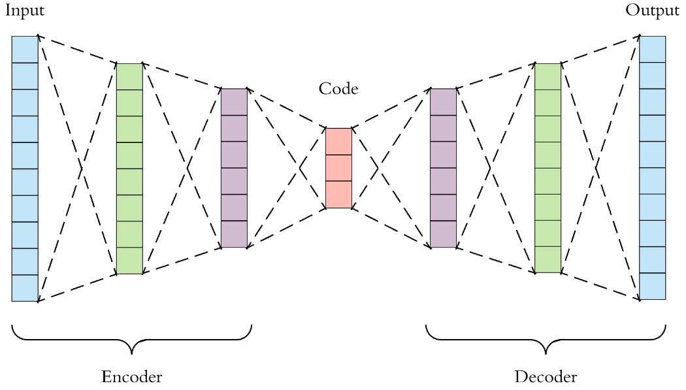

# 浅谈AE(Auto Encoder)

自编码器Auto Encoder，简称AE，实际上就是一个**Unsupervised Model**，其整体架构为Encoder + Decoder，所以也就是一个编码到解码的过程。

## 既然是Unsupervised Model，那训练目标是什么？
举例来说，假设数据集是无标注的图像，那么input就是图像，output也是图像，也就是图像还原的过程，在这个过程中，图像先由高维进行压缩，压缩到低维表示，也就是图中的Code，Code再经由Decoder进行解码还原回图像。
**所以本质是一个压缩——重建的过程**

## 为什么低维特征可以还原回高维原始数据？
以图像为例，虽然原始数据维度可能很高例如(3\*224\*224)，但实际上图像的变化对模型来说可能是有限的，即图像的变化可以用有限的维度表示，而实际证明也是如此，所以Code的维度一般比较低。

## 如何将PreTrained好的AE使用到下游任务上？
本质上AE最主要的就是依靠Encoder对原始数据进行压缩，得到一个稳健的低维特征表示，所以如果想迁移到下游任务上主要也是使用Encoder，例如当前我的输入维度很高，训练起来较为困难，那就可以用AE的Encoder将输入先压缩到低维特征，再去做具体的任务。