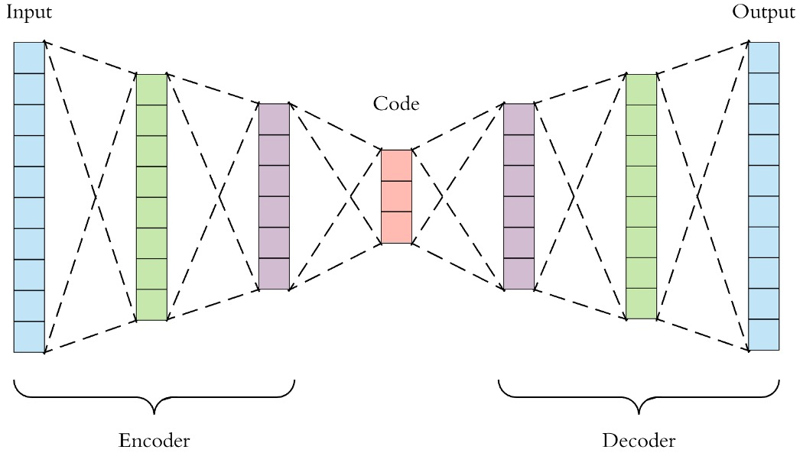
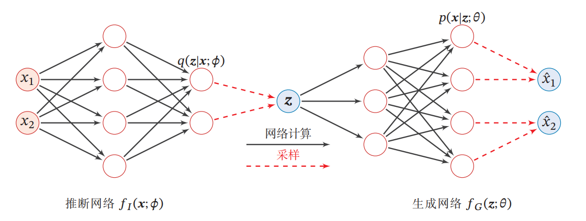
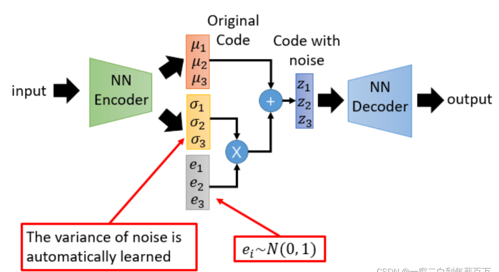
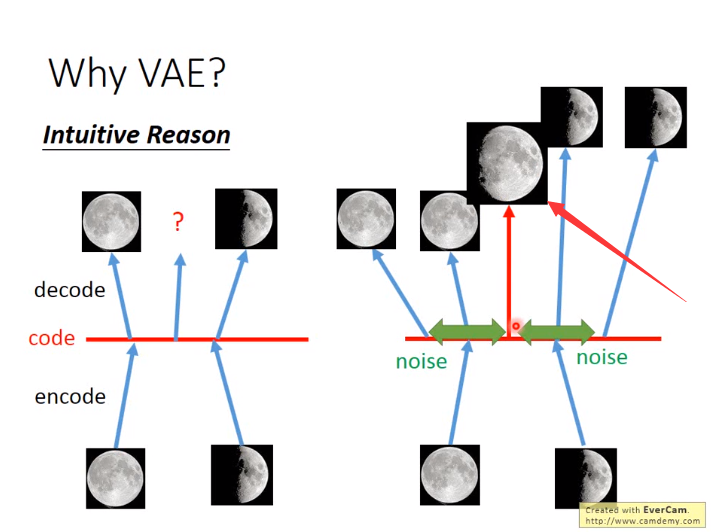
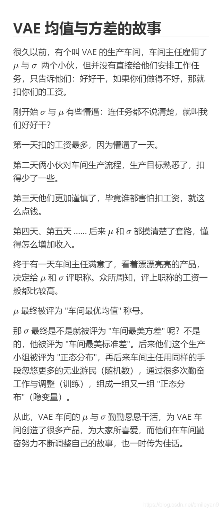

# [Auto-Encoding Variational Bayes](https://arxiv.org/abs/1312.6114)

## AE

先回顾下AutoEncoder的架构，Encoder将Input的维度压缩成低维特征表示Code，再由Decoder解码映射回高维空间Output，是一个**压缩——还原**的过程。

**AE可以做图像生成生成吗？**
显而易见是不行的，最直观的理解就是，如果我们要进行生成，那这个Generator应该是Decoder，假设我们随机从高斯分布Sample了一组Code，丢入这个Generator，大概率会生成一张噪音，原因显而易见，在训练过程中，一张图像经过Encoder压缩为的Code是唯一的，可以想象成低维空间的一个点，所以对于Decoder来说，**只有输入是这个点，才能还原回一张图像。**

## VAE

VAE是包含隐变量的生成模型，从结构来看其实就是一个AutoEncoder的架构，编码器换成推断网络，解码器换成生成网络，那改动在什么地方呢？
来看下面的架构:

**Encoder的输出变了**
按照李宏毅老师的说法是，$\mu_i$可以理解成之前的Code，也是Encoder学到的均值，$\sigma_i$则是Encoder学到的方差，$e_i$是从高斯分布随机sample的一组噪声，本质上就是给Code加上了一组噪声，但是为什么要这样呢？

图像左边是AE，当输入一张满月图给Encoder得到Code，这个Code又经过Decoder还原回满月图，弦月图也是如此，但是注意**Encoder——Code——Decoder直接是一对一的关系**

图像右边是VAE，我们在Code中添加随机的Noise，这样相当于在Noise范围内的Code都可以还原回满月图和弦月图，假设此时我们对Code进行采样，采样到介于满月和弦月之间的Code，这时候生成的图大概率是介于满月和弦月之间的图。

所以也就是，**VAE通过这个Noise产生了输入数据中不包含的数据，而AE只能产生接近接输入的数据**

**区别**
* VAE中的隐藏层服从高斯分布，AE中的隐藏层无分布要求

* 训练时，AE 训练得到 Encoder 和 Decoder 模型，而 VAE 除了得到这两个模型，还获得了隐藏层的分布模型（即高斯分布的均值与方差）

* AE 只能重构输入数据X，而 VAE 可以生成含有输入数据某些特征与参数的新数据。

## 理论基础
这部分太过复杂，自己也没太弄明白，贴篇博客在这儿[VAE 模型基本原理简单介绍](https://blog.csdn.net/smileyan9/article/details/107362252)

## 为什么Encoder的输出可以是均值和方差？
VAE的Encoder输出为$\mu_i$和$\sigma_i$，为什么不能是其他数据？最直接的理解是，首先我们认为规定隐变量z输入正态分布，损失函数也是基于z属于正态分布求出的，所以在训练过程模型会不断优化到符合z的分布，因为只有z属于正态分布的时候损失才能尽可能低，这里贴个小故事。
