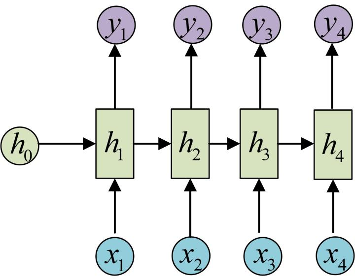

# Long Short-Term Memory Network

## Motivation

### RNN存在的问题：长期依赖(Long-TermDependencies)
首先对长期和短期依赖举个例子，均基于predict next word来说明

* 短期依赖：the clouds are in the **sky**，sky是需要预测的word，很显然对于预测这个word不需要其他的信息，因为这只是一个长度很短的seq，相关信息和predict word之间的间隔是很小的，这时候RNN可以利用先前的信息做推理。

* 长期依赖：I grew up in France (---long seq) I speak fluent **French**，French是需要预测的word，所以此时要进行预测，那么相关的信息是在离当前较远的位置。

回顾RNN，这个Network之所以经典关键就是它可以将先前的信息连接到当前的任务上，从理论上来说，RNN的架构完全可以处理长依赖问题，但是这也只是理论，但实际上RNN很难学习这种长期依赖的问题，换句话说，**RNN会受到短时记忆的影响，如果一个序列足够长，RNN很难将信息从较早的Step传到较晚的Step，大概率会出现“遗忘”。同时，随着时间的推移，反向传播的梯度也会很不稳定(过大or过小)。**

做个总结:**在递归神经网络中，获得小梯度更新的层会停止学习—— 那些通常是较早的层。 由于这些层不学习，RNN会忘记它在较长序列中以前看到的内容，因此RNN只具有短时记忆。所以LSTM的提出就是为了解决RNN的这个问题。**

## LSTM
LSTM_block有很多种画法，个人觉得台大李宏毅老师的比较直观。

从最广为人知的三个“门”(Gate)来做个介绍，实际上这三个门的开启与闭合是由0，1实现的：

提前说明：

**1、激活函数均为Sigmoid(Forget Gate为tanh(-1,1)),因为Sigmoid的范围是0-1，正好能以multiply的方式表示开闭**

**2、$Z_i、Z_o、Z_f$均为输入$Z$通过linear transform实现的，所以门的开闭是可学的**

* input Gate：这个Gate的主要作用就是控制输入，当开启时输入会参与后续计算

* forget Gate：遗忘门主要负责控制Cell(理解为存储的历史信息的Memory)的遗忘和更新，当开启时Cell会更新，更新方式如图

* output Gate：主要控制是否对结果进行输出

上图是LSTM整体的架构，和RNN一样，T时刻的输出同样会考虑T-1时刻的h和当前输入X。

所以本质上LSTM就是**对记忆有选择的筛选，忘掉不重要的，记住重要的**。

## 常见变体

* GRU

* Peephole