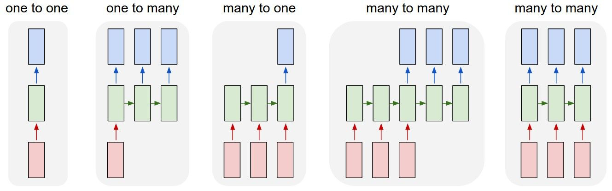
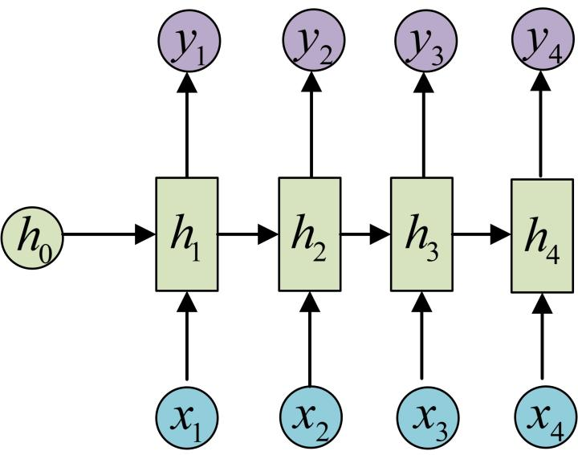

# Recurrent Neural Network

## Motivation
在以往的Feed Forward Network中，网络不亏考虑输入的上下文关系，因为整体架构是并行的，当前输出只考虑对应位置的输入而已，那这样不免产生了语义混淆问题。在生活中一词多义的情况是普遍存在的，所以对于一个句子的理解，也就是模型的预测，结合上下文关系是很重要的。

所以本文提出Recurrent Neural Network(RNN)，来解决这个语义混淆的问题。

## Framework
RNN存在多种结构，如下图所示：

每个结构其实主要就是输出不同，所以主要介绍下many2many的结构，也就是常说的seq2seq。

**特别说明，每一层的Hidden Layer权重参数共享，也就是图中的$h_i$**

所以为什么说RNN在输出的时候会考虑前文呢？

以$h_3$为例，$h_3$在计算的时候会同时考虑$h_2$和当前输入$x_3$，同时$h_2$又是通过$h_1$和$x_2$计算得到的，**所以$h_i$个人理解是对之前序列信息的聚合，这样就能兼顾前序列的信息，从而合理的对结果进行预测。**

以公式来表达：
* $h_3 = f(Ux_3 + Wh_2 + b)$

* $y_3 = Softmax(Vh_3 + c)$

