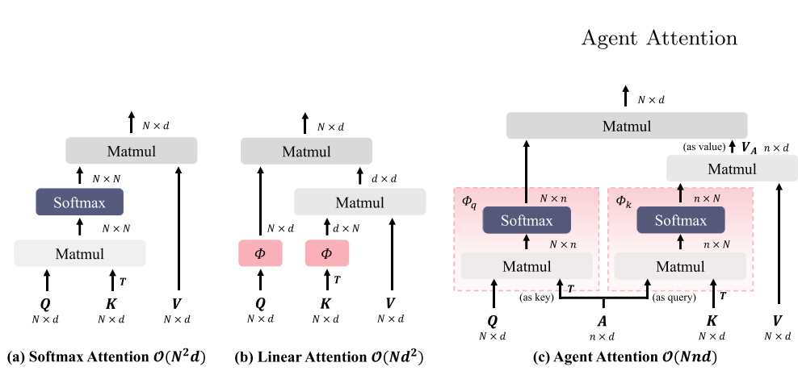
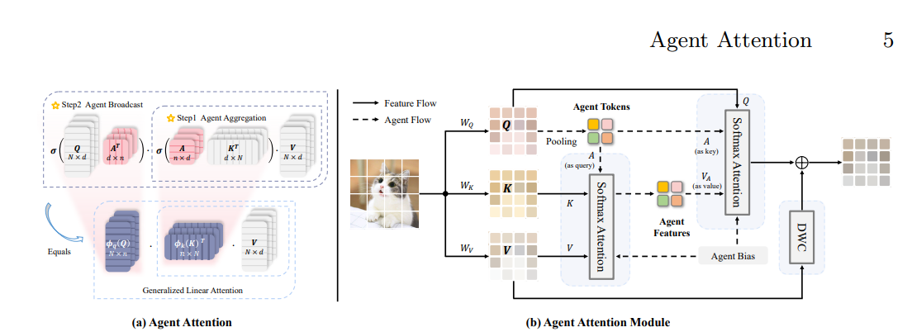

# [Agent Attention: On the Integration of Softmax and Linear Attention](https://arxiv.org/abs/2312.08874)

## Abstract
本文提出了一种非常novel的注意力机制——Agent Attention,取得了**计算效率**和**表征能力**之间的平衡。具体的，Agent Attention通过引入agent token A，聚集K，V的信息，最后将该信息广播回Q，时间复杂度低O(Nnd)，并且在多项任务上表现出色，特别的，对于Stable diffusion，该模块无需训练，就可提升图像的生成质量和减小图像的生成时间。

## Motivatetion

Softmax Attn由于要计算所有Query和Key之间的相似性，所以是平方的时间复杂度，Linear Attention改变了计算顺序，降低了时间复杂度，但是，映射函数fai需要人工设计，并且很难达到Softmax的表征能力。

因此，本文的动机是**消除每个Query和Key之间的直接联系，使用维度更小的agent tokens作为Query的代理，从所有特征捕捉多方面的语义信息，然后将其广播给每Query**

## Method

Agent Attention的计算主要分为两个步骤:
* A作为Query，和Key，Value做Softmax Attention得到V_new
  
* A作为Key，和Query，V_new再次做Softmax Attention得到最后的Attention Score

**总的来说，A先当成Q的代理，聚合Key和Value的信息，然后再广播回Query**

Agent Attention Moudule由几个需要关注的点:
* Agent Token在本文中是对图像做CNN的池化得到的，当然也有其他方式，但是这样的效果已经很出色了

* DWC是深度可分离卷积，由于Agent Attention是广义的Linear Attention，所以一样会存在Linear Attention的问题，即表征能力不强，所以引入DWC来弥补这一缺点
  
## Advantages
* 高效的计算能力和高表征能力的并存(毕竟结合了Softmax Attention和Linear Attention的优势)

* 更大的感受野(由于计算效率高，所以能采用更大的感受野)