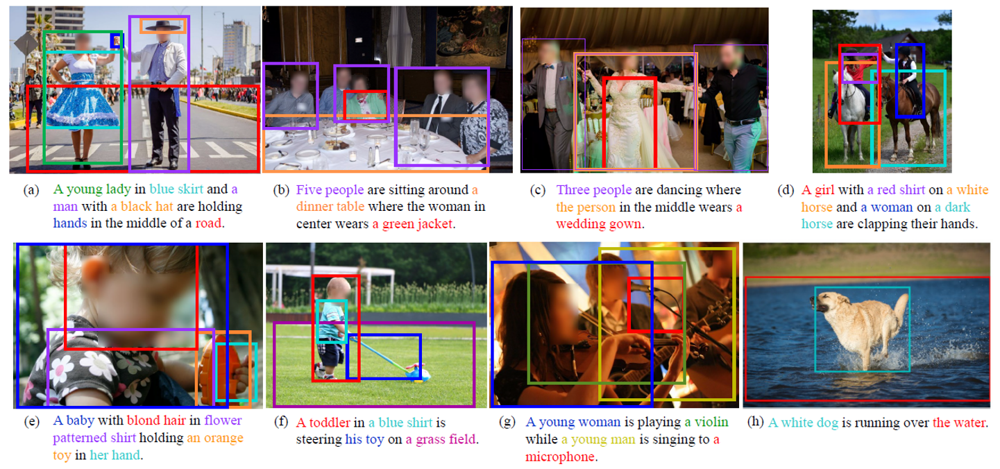
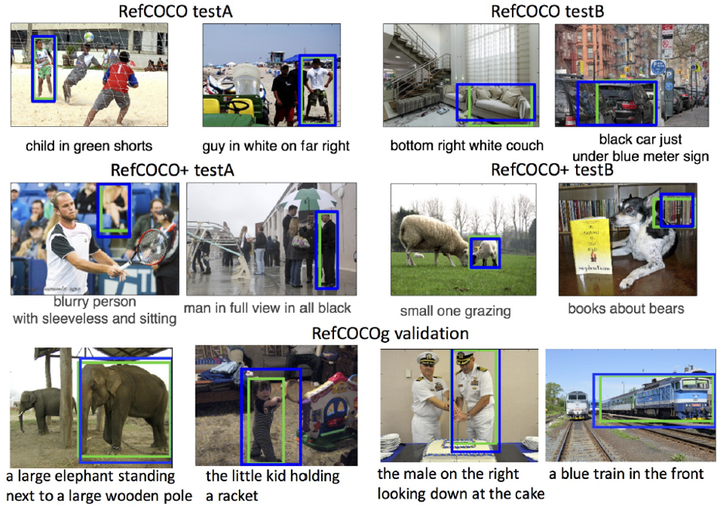
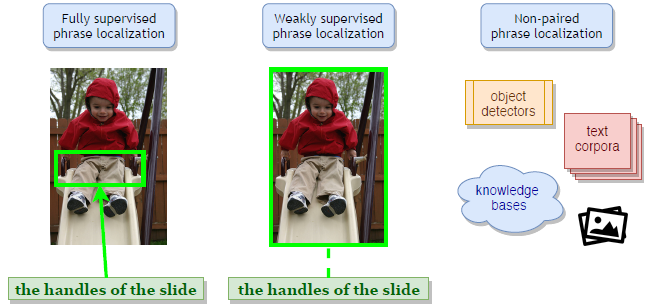

### Visual Grounding简介
visual grounding是vision-language的子任务，具体而言，输入为image&sentence，输出是描述物体的bbox，和目标检测比较类似。但是，由于输入多了一个语言模态，所以在对物体进行定位时，要先理解text的语义信息，并且和image feature进行fusion，才能预测。
visual grounding按照是否要对语言描述中所有提及的物体进行定位，可以进一步划分为两个任务：
* 1、Phrase Localization：又称为Phrase Grounding，对于给定的text，要求定位其中的所有物体

* 2、Referring Expression Comprehension：每个语言描述也只指示一个物体，即使text上下文出现其他物体，也只会出现一个标注框

### 主流做法
目前visual grounding可以分为全监督（Fully-supervised）、弱监督（Weakly-supervised）、无监督（Unsupervised）三种。

* 全监督（Fully-supervised）: 有object-phrase的box标注信息
  
* 弱监督（Weakly-supervised）：输入只有image和对应的sentence，没有sentence中的object-phrase的box标注