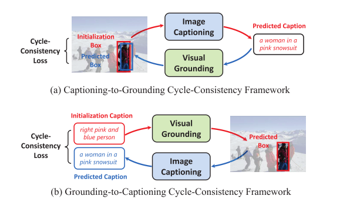
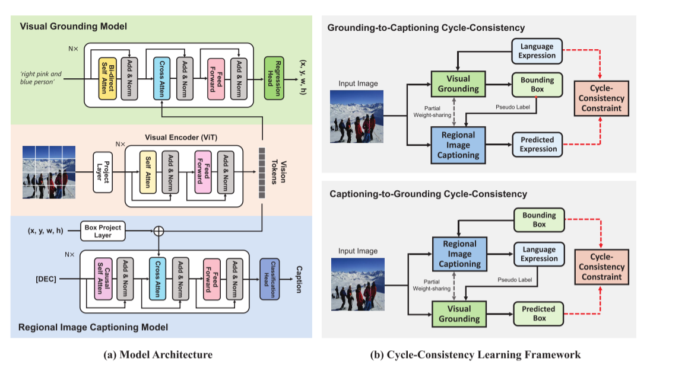

### Cycle-Consistency Learning for Captioning and Grounding(AAAI)

#### Abstract
作者指出image caption和visual grounding其实是一个互逆的过程(核心动机)，提出了CyCo这个循环一致性的framework来改进之前caption和grounding独立训练的过程(变成联合训练)。

**这个框架的目标**

* 1、允许visual grounding的弱监督训练

* 2、提升了visual grounding在有监督训练下的表现

* 3、生成一个通用的caption模型，可以描述任意的图像区域

**提出问题的背景**

* 1、visual grounding受限于数据标记，这个task需要细粒度的文本描述和bbox，所以如何能高效的利用已有数据集或者是利用未标注的数据集是值得思考的
  
* 2、对于image caption，现有的算法在很大程度上忽略了区域关系建模和正确描述的能力，一个强大的captioner应该可以任意的描述任何图像，从不同区域到整个图像
  

以图a为例，Caption-to-Grounding的过程可以这样描述，初始只需要一个BBox和Image作为输入，经过Captioner后，得到Predicted Caption，这个Caption送入Visual Grounding Model得到Predicted的BBox和Ground Truth计算损失

#### Contribute
* 1、使用一个统一的框架桥接两个独立的VL任务(Caption and Grounding)

* 2、设计了一个简单的区域级image caption model和基于transformer的grounding model，进一步的将这两个模型组合成一个统一的框架，并且共享权重
  

#### Method

##### Model Pre-training
预训练的方法和BLIP类似

* Vision Encoder ：ViT-B/16

* Image-Grounded Text Encoder：这部分模块首先在输入文本的开头嵌入一个特殊标记[ENC]，然后利用双向self-attn对token进一步编码，并且通过cross-attn进行多模态融合，[ENC]的输出嵌入用来计算Loss_ITM

* Image-Grounded Text Decoder：这里和Encoder类似，也嵌入了一个[DEC]标记，这里解释一下为什么要嵌入[DEC]，正常来说做caption完全可以把bbox区域直接送入模型中去生成caption，但为了全局建模的能力，这里对输入的bbox先嵌入到vision token中，再和text-token进行多模态融合

##### Cycle-Consistency Learning Frameworke
如何将预训练模型迁移到下游任务呢，以图(b)所示，对于Grounding-to-Captioning，输入时一个caption(x)和image(v)，image通过预训练中的vision encoder进行编码，bbox_pred = Model_vg(v,x)，x_pred = Model_ic(x_pred,bbox_pred)，最后计算Loss = Loss_Cycle-Consistency(x,x_pred)

#### 总结
还蛮有意思的方法，实际就像数据增强，多了伪标签