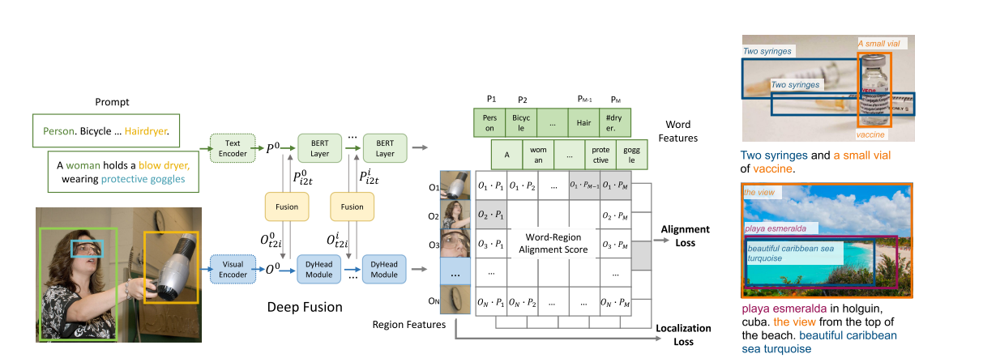

### Grounded Language-Image Pre-training

#### Abstruct

提出了GLIP用来学习Object-level(region)，language-aware(语言特征)和丰富的语义信息的表征。
两个优点:
* 1、GLIP从detection data和grounding data学习
* 2、GLIP通过self-training的方式获得大量的图像文本对，使学习到的表征具有很丰富的语义信息
  
#### Contribute
* 1、将Object Detection重新定义为phrase grounding来统一detection和grounding ：object detection可以看作是上下文无关的phrase grounding，而phrase grounding又可以看成是一个上下文的object detection。具体而言，任何的目标检测模型都可以通过将检测头替换为（word-to-region matching）的对齐分数来变成phrase grounding model。本质还是算image-text的相似度

* 2、Scaling up visual concepts with massive image-text
data ：说白了就是将一个在有监督数据集下得到的大模型当作教师模型去给大量无监督数据集生成伪标签，丰富语义信息

* 3、Transfer learning with GLIP: one model for all : 得益于GLIP强大的zero-shot能力，GLIP可以很好的迁移到各个数据集上，如COCO，LVIS等等，并且都能取得很好的效果。

#### Method
##### Object detection as phrase grounding
这里着重讲一下怎么把Object Detection去定义成一个phrase grounding任务
* 首先，对于典型的目标检测来说，分类损失(定位损失由于都一样，这里不赘述)我们可以统一成这样的一种形式：对region proposal抽取特征得到O(image) -> 计算S_cls = O * W(分类的权重矩阵) -> 最后分类损失Loss_cls = (S_cls,Ground_T)。
  
* Object detection as phrase grounding ：考虑不把每个rigion/bbox去分类成c个目标，而是去把每个rigion/bbox和一个prompt中的c个phrase做对齐。举个例子：给定目标类别[person, bicycle, car, ..., toothbrush]，设置Prompt:"Detect:person, bicycle, car, ... , toothbrush"。这里的每个class都是需要定位的候选phrase。在Grounding model中，我们去计算image和prompt中的word的对齐得分(Score)，于是，我们仿照上述公式去定义这个得分的计算方式：**对region proposal抽取特征得到O(image) -> 通过text-encoder得到prompt的特征P -> 最后对齐的分数即为O * P^T 。**

##### Language-Aware Deep Fusion
对于Grounding任务来说，deep fusion是十分重要的，GLIP的对齐得分仅在最后计算，属于晚期融合。如结构图所示，prompt和region proposal各自进行encoder后并没有直接计算相似度。对image而言，GLIP选择了DyHead moudle作为encoder，text则是选择了Bert 作为encoder。对于DyHead moudle，我们称其抽取得到的特征为O_i，而Bert抽取得到的特征为P_i，这两个通过cross-attention进行融合，即cross-attention(O_i,P_i)

#### Conlusion
本质就是替换Object detection中的分类损失，把bbox分类成类别看成是将bbox和prompt中的phrase对齐，去最大化这个对齐得分。当然这里并不是像CLIP那样只是通过简单的点积计算相似度，这里用了更深层的fusion
