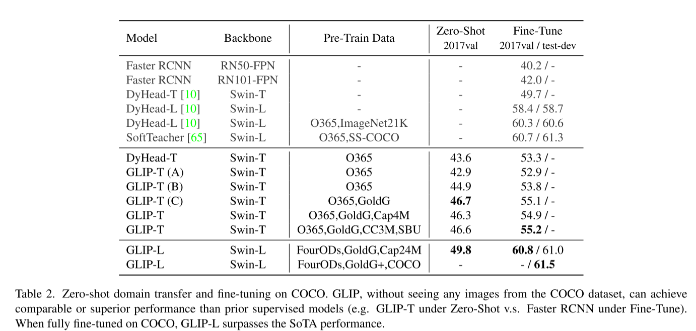

# [Grounded Language-Image Pre-training(GLIP)](https://arxiv.org/pdf/2112.03857) 
(虽然之前已经做过这篇的report了，但今天突然觉得之前的笔记实在是太烂了，所以想做个更详细的，毕竟这篇对Visual Grounding的意义非凡)

## Abstract
本文提出了GLIP来学习Object-level，language aware，semantic-rich visual representation，说白就是现在的视觉表征和文本语义信息紧紧关联起来了。**GLIP将
Object Detection和Visual Grounding统一**，这个统一带来了两个好处：

* GLIP可以同时使用目标检测+Visual Grounding的数据集进行训练

* GLIP可以通过Self-Supervised的方式生成大量的VG数据(伪标签)

## Intro & Motivation
我们知道，对于目标检测任务来说，target categories是固定的，比如COCO，只有80个类别，所以这样的问题就是，在这样的目标检测数据集上训练的模型，很难迁移到其他数据集上(除非重新开始训练)。这样对数据集的利用率是十分低的，本身目标检测数据集的标注成本就高。

CLIP的出现可以让模型学到Image-Caption Level的表征，但这不够，大部分任务都是需要更细粒度的Level，所以本文表明，Visual Grounding是一个有效并且可扩展的预训练任务，并且提出了GLIP，该方法统一了Object Detection和Visual Grounding：**Object Detection可以看作是上下文无关的Visual Grounding，Visual Grounding可以看作是上下文的Object Detection。**

### Unifying detection and grounding by reformulating object detection as phrase grounding
重定义后的目标检测的input就不仅仅是一个image了，而是描述所有类别的candidate categories，这部分的具体实现会在后面提到。举例来说，COCO dataset有80个类别，那么对于COCO dataset来说，所有图片的Prompt都是[Class1.Class2....Class80]这样的一个caption。那么此时，目标检测模型都可以通过word-region的对齐分数来代替原本的分类逻辑损失。

### Scaling up visual concepts with massive image-text data
这部分就不详细介绍了，就是用VG+Object Detection dataset先预训练好一个GLIP，这个GLIP作为Teacher，去预测大量的image-pair的Grounding，然后综合这些数据重新训练一个GLIP。

### Transfer learning with GLIP: one model for all
这部分也是作者在文章中重点强调的部分，GLIP的Zero shot能力，不需要微调即可在COCO和LVIS上取得很不错的成绩，但其实也很好理解，预训练的时候数据集规模已经十分庞大了，并且按以往经验而言，只要vision embedding能和text embedding对应上，基本Zero shot的表现都很好，比如CLIP。

## Method

GLIP整体的框架如图，后面Alignment的部分特别像CLIP，只是变成了更细粒度的对齐，下面讲讲具体的方法。

### Object detection
损失部分其实GLIP和典型的目标检测没有很大区别，所以先从这部分讲起。

对于一个典型的目标检测模型，通过CNN or Transformer这样的Backbone提取Region Box的特征，同时这个特征会进入一个Classifer，和一个Box Regressor，也就是分类损失和框的回归损失，很好理解。那么**总损失就是$L = L_{cls} + L_{loc}$**。

**特别说明下，由于GLIP的Region Proposal是由RPN产生的，RPN有自己的损失$L_{rpn}$，所以GLIP的$L_{loc}$是包含这部分损失的**

$L_{cls}$可以被下面的公式表示：

$$O = Enc_{I}(img) , S_{cls} = OW^T , L_{cls} = loss(S_{cls},T)$$

其中，$O\in R^{N*D}$,$W\in R^{c*D}$是一个映射权重矩阵，$S_{cls}\in R^{N*c}$是输出的分类逻辑，也就是预测结果，$T\in \{0，1\}^{N*c}$是GroundTruth

### Object detection as phrase grounding
GLIP不像目标检测那样把某个Box分类成c个类别，而是把每个phrase和box对齐。那问题来了，**怎么设计目标检测的text prompt?**

给定目标类别[person, bicycle, car, ..., toothbrush]，一个很简单的方法就是构建这样一个Prompt:{“Detect: person, bicycle, car, ... , toothbrush}。当然也可以用预训练好的LLM对各个类别生成更好的Description。不过本文最后还是用的[person.
bicycle. car. ... . toothbrush]这样的Prompt。

所以，按照这样的定义，$L_{cls}$可以被重新定义为以下的形式:

$$O = Enc_{I}(img) , P = Enc_{L}(Prompt) , S_{ground} = OP^T,L_{cls} = loss(S_{cls},T)$$

所以也就是把$S_{cls}$替换成了$S_{ground}$，其中$ P\in R^{M*d} $是token/word features。

但是吧，这样做会有一个维度上的问题，**具体而言就是$T\in \{0，1\}^{N*c}$,但是$S\in R^{N*M}$，维度不匹配了，没办法计算损失。** 并且这个M通常是大于c的，为什么会出现这种情况？

这部分原因就用了原文，比较直观。

* some phrases contain multiple words : “traffic light”

* some single-word phrases are splitted into multiple (sub)-word tokens ： “toothbrush” to “tooth#” and “#brush”

* some are the added tokens ： “Detect:”, “,”, special tokens

* a [NoObj] token is added at the end of the tokenized sequence
  
**所以GLIP的方法是对$T$进行升维**：如果一个phrase是正匹配，也就是box和phrase对应，那么phrase的所有子词都是正匹配，并且添加的所有提示词如“Detect,，”都是负匹配，这样就得到了$T'\in R^{N*M}$

### Language-Aware Deep Fusion

这部分就不敲公式了。Grounding这种细粒度的任务更需要image text深度的fusion，像CLIP那种就是比较粗糙的融合方式，所以做不了这些任务。GLIP设计的模块也很直观，就是Bert layer和Dyhead module出来的feature通过CrossAttn不停跨模态进行交互。

## Experiment
实验部分的细节还蛮多的，可以读原文找找细节，这边就只做一个简单的介绍。

作者设计了多个GLIP去验证每个method的方法，例如：只有OD数据集or只有VG数据集，是否使用Deep Fusion

