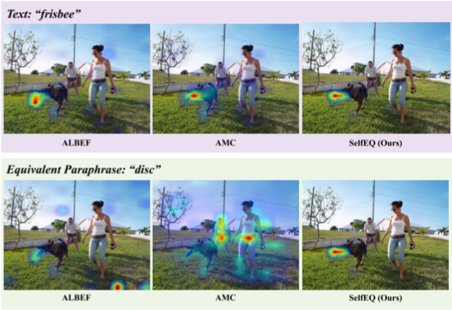
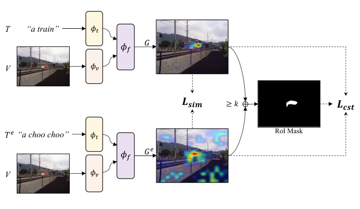

# [Improved Visual Grounding through Self-Consistent Explanations](https://arxiv.org/abs/2312.04554)

## Abstruct
本文提出了一个新的weakly supervise的训练策略SelfEQ。具体来说，对于一个输入的图像文本对，使用一个LLM对文本生成新的表示(例如释义，同义词替换)，并且希望通过对模型进行finetune使原始短语和新释义映射到图像中的同一区域。这个方法不仅扩展了模型能够处理的词汇，同时又提高了Gradient-Base例如Gradcam对目标定位的质量。

## Motivation
对于一个图像文本对来说，将其中的文本换一个表达方式，新文本和旧文本的语义信息应该是相同的，所以其映射到图像中的位置也应该是相同的。并且，像ALBEF这种已经训练好的VLM对于常见短语有很强的定位能力，所以由这种VLM得到的HeatMap就是一种很强的监督信号。**所以，对于由同一个图像的新文本和旧文本生成两个热力图，其热力值分布应该是相近的。**

## Method

整体的Framework如上图，其中$\Phi$是ALBEF(PreTrained)。

流程如下：
* 使用LLM对原始的短语生成释义得到新的文本$T_e$，这里可以看成是一种文本增强

* 将两个图像文本对<$T$,V>和<$T_e$,V>输入到ALBEF中利用GradCAM生成两张HeatMap，计算两张HeatMap的相似度，同时如果两图中某区域的平均热力值大于k，就把这个区域当成RoI Mask，使两个热力图中该区域的热力值尽可能一致。

这里说下LLM的细节：
* 一共有两个层级的Prompt

* 第一层相当于把一整个Sentence拆分，得到不同的短语，每个短语只包含一个名词
  
* 第二层就是生成短语的释义
