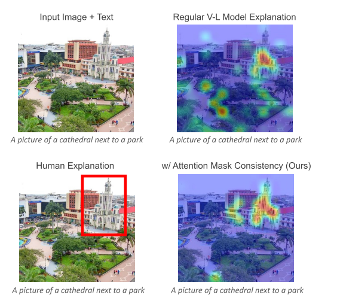
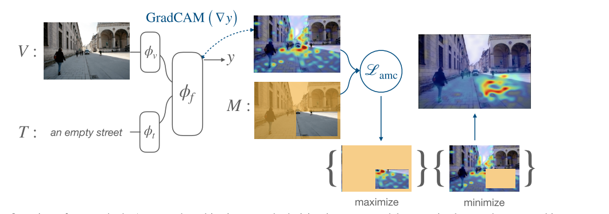

### Improving Visual Grounding by Encouraging Consistent Gradient-based Explanations(CVPR)

#### Abstract
提出了Attention Mask Consistency(AMC)来让vision-language model的梯度更关注由数据集提供的region-level annotations。说白了就是让模型在训练的时候，能更关注text中提到的object的信息，只是这里不是用注意力做的，而是根据GradCAM生成的热力图设计损失。

如图，对于人类来说，给定一个image和text，我们更关注的区域如左图，对于普通模型来说，其关注的地方更加分散，而本文提到的AMC可以让关注区域更加集中

优点：
即插即用，并且增强了image和text两种模态之间的联系

#### Contribute
* 1、提出了一个简单有效的新训练目标，并且可以处理多种类型的region annotation
  
* 2、提出的AMC可以提升模型的grounding能力

* 3、在给出的两个benchmark中本文的方法是最先进的

#### Method
##### Attention Map Consistency (AMC)

假设(V,T,M)为一组数据，其中V为image，T为text，M为一个二进制的掩码mask，M_ij只有当这个像素落在region也就是bbox内部的时候才为1，否则为0。首先从multimodal fusion transformer获取到image和text进行fusion后的特征F_z，然后去计算特征F_z相对于单个样本的IMT(image text matching loss)的梯度G_z，然后通过F_z和G_z计算出一个GradCAM attention heatmap，这个热力图可以很好的解释模型关注的区域。

最后则是设计了两个损失L_mean和L_max，L_mean是去优化最大margin loss，使得ROI内部的热力图均值大于外部的热力图均值。L_max是确保match score尽可能服从热力图分布，反正就是让M区域中的得分尽可能高。

