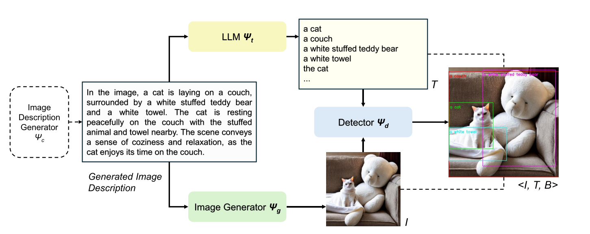
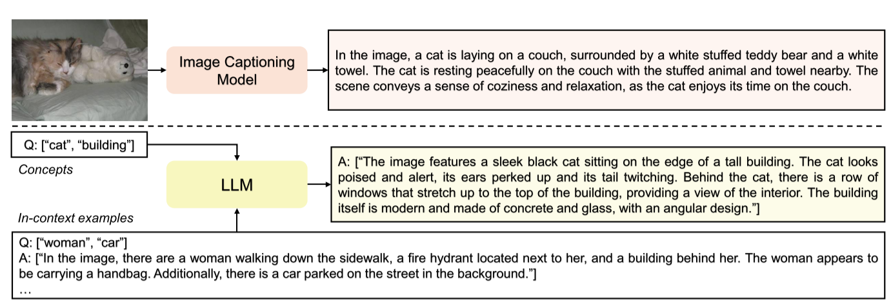
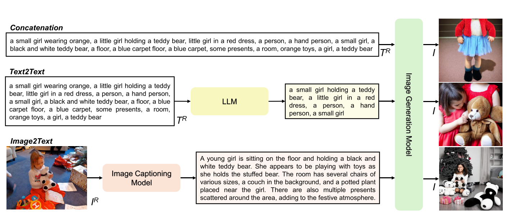

# [Learning from Models and Data for Visual Grounding](https://arxiv.org/abs/2403.13804)

## Abstract
本文提出了一个新框架——SynGround，该框架结合了数据驱动学习和从大规模预训练模型的知识迁移去提高VLM的Visual Grounding能力。模型的知识迁移是通过由image caption generator生成的description来传递的。这些description有两个作用，一是作为text-to-image generator(例如Stable diffusion Model)的prompt，二是作为合成文本的query，用LLM从文本里提取短语。最后本文利用Open Vocabulary Detector为合成的文本和图像生成Bbox，利用这些数据在AMC上finetune。

## Motivation
对于Visual Grounding来说，数据是十分重要的，但是大规模的标注数据的成本是十分高的，相反，从相关模型学习很灵活但是效率很低。本文提出的paradigm能够更有效的利用data&model。之前的工作已经证明通过合成数据来增强真实数据集来对模型进行训练是有前景的工作，**但是，之前生成的caption是粗粒度的，即该caption是描述整个image的，这些合成数据对于VLM的Visual Grounding能力的提升意义不大**。所以本文提出的SynGround能生成细粒度的区域级描述(I,T,B)。

## Method

整体框架如图，具体分为四步：

* 由Image Description Generator生成Description

* 使用LLM将生成的Description进行短语的提取，生成一系列短语词组

* 生成的Description作为Image Generator的Prompt生成图像

* 短语词组做为Prompt和生成的图像一起送入Open Vocabulary Detector得到一些列的BBox，至此，区域级的<I,T,B>数据生成完毕。

下面详细介绍下各步骤是怎么完成的。

**Description的生成**

本文提出了两个生成Description的策略：

* 1、使用真实的图像，通过Image Caption Model得到Description
  
* 2、不需要真实的图像，通过LLM的提示学习生成Description

**图像的生成**

本文提出了三个生成Image的策略：

* 1、合并与真实图像相关联的所有Caption，用这个Caption List作为Image Generator Model的Prompt

* 2、使用LLM对Caption List进行汇总，相当于生成摘要

* 3、通过真实的图像，使用Image Caption Model先生成Description，再将该Description作为Image Generator Model的Prompt

**Boxes的生成参考Framework**

