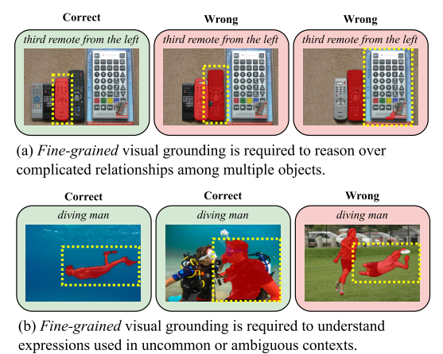
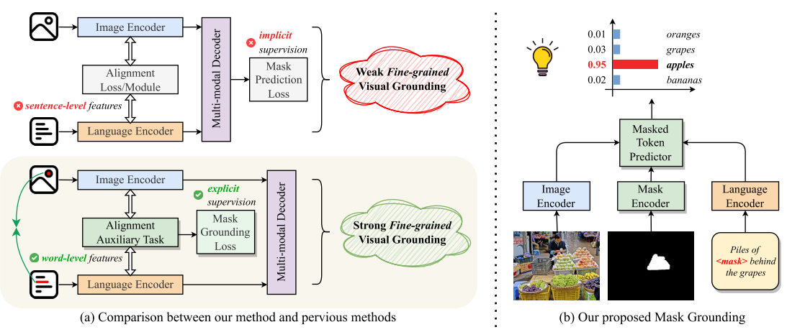
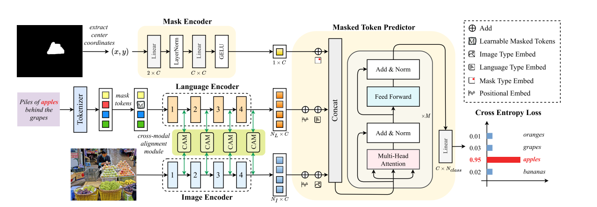
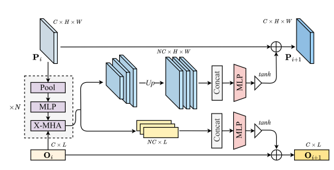

###  Mask Grounding for Referring Image Segmentation(CVPR)

#### Abstract
**Referring Image Segmentation (RIS)：对文本指定的object进行分割，和普通的grounding任务不同，多了个refer，也就是推理的过程，举个例子：输入文本是the third kid ，那么输出的掩码就应该是第三个kid，而不是其他两个**

所以相比于其他任务，RIS需要更细粒度的文本图像对齐，才能够去推理理解文本和图像之间关系，为了解决这个问题，本文提出Mask Grounding 的辅助任务。

#### Contribute
* 1、指出了之前RIS领域SOTA算法中的缺点是缺少细粒度的visual grounding

* 2、提出了Mask Grounding这个辅助任务增强了之前算法中细粒度的visual grounding
  
* 3、同时在Mask Grounding中也设计了一个cross-modal alignment loss和对齐模块

#### Method

##### Mask Grounding

具体而言，对输入的Mask Text Image各设置了一个Encoder，在训练过程中(进入Text Encoder之前)，随机的对文本中的某个token进行mask，然后三种模态的输入各自编码对齐后，通过Masked Token Preditor模块去预测这个缺失的Token，**这里最关键是这个token不仅通过上下文预测，同时也借助了image和mask，这也是对齐能力增强的原因**

抽象成公式：

input(M,T,I)

O = LanguageEncoder(Mask(**T**))

P = ImageEncoder(**I**)

C = MaskEncoder(**M**)

Loss_grounding = Loss_ce(y_gt,Predictior(concat[O,P,C]))

##### Cross-modal Alignment Module

CAM通过预先把全局上下文先验注入图像特征来提高image-text对齐的能力

CAM首先通过不同大小的池化操作获得不同尺度的特征图，然后这些特征图通过3层的MLP来更好的抽取全局特征信息，随后这些特征通过双线性插值将所有特征上采样回原始尺寸进行concat，最后使用两层MLP将这些特征的通道维度降维回原始尺寸。同时为了防止多模态的signal掩盖了原始的signal，这里使用tanh来调整最后输出。

**X-HMA** ：双向的跨模态多头注意力

#### 个人总结
这篇文章中辅助任务的设计思路很清晰，最终效果也很好，这种方法也很容易迁移到其他任务上，比如Grounding Detection。